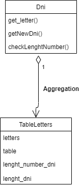
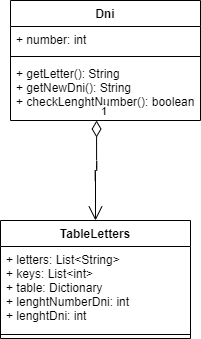

# DNI_Kata_POO
This repository is focused on creation of the DNI's kata. This Kata consist of write a program that, given a DNI number, obtains the letter of the NIF, This Kata is from "Panel de Actividades" to do from Programming subject

# DNI KATA Domain Driven Development (DDD)

## Dominio del problema:
Write a program that, given a DNI number, obtains the letter of the NIF
## Domain Vocabulary DNI:

### DNI
It's a identity National Document, which consist of a number of 8 digits and a letter.
### letters of DNI
Consist of a group of certain amount of letter that can be used for a DNI number, because there are letter that can't be used for a DNI
### Table Dni
It's a asignation Table that contains letter can be assigned to a respective number to become a DNI where columns of number with positions and the values of this columns are letters

# Modelo de Dominio DNI Kata

# Diagrama UML DNI
